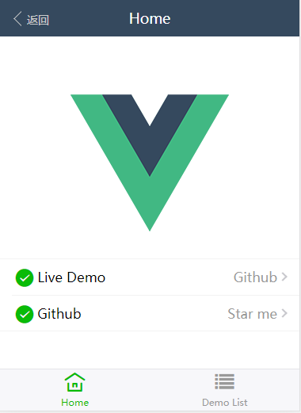
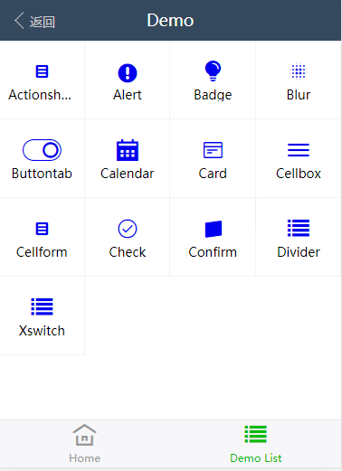

# vuxUI



## 配置
* 环境: Vuecli3
  
* 1、安装vuex

    `npm install vuex --save-dev`

* 2、在项目里面安装vux

    `npm install vux --save`

* 3、安装vux-loader（必须安装）

    ` npm install vux-loader --save-dev`

* 4、安装less-loader（这个是用以正确编译less源码，否则会出现 ' Cannot GET / '） 
  
    `npm install less less-loader --save-dev`

* 5、安装yaml-loader  (以正确进行语言文件读取)

    `npm install yaml-loader --save-dev`
* 6、安装vue-loader   (必须指定版本不然会提示错误)

    `npm install vue-loader@14.2.2 -D`

* 7、在配置文件vue.config.js添加配置
    ``` js
    module.exports = {
        configureWebpack: config => {
            require('vux-loader').merge(config, {
                options: {},
                plugins: ['vux-ui']
            })
        }
    }
    ```
* 8、enjoy


> 安装参考: [https://blog.csdn.net/Honnyee/article/details/82181620](https://blog.csdn.net/Honnyee/article/details/82181620)

## 图标

[阿里巴巴矢量图](www.iconfont.cn)


> **VUX 必须配合 vux-loader 使用，如果不使用 vux2 模板请按照文档正确配置。less@3.x 有严重的兼容问题，请暂时使用 less@^2.7.3。暂未适配 vue-cli@3.x，请知悉。**


* 莫名奇妙报错有点难受,暂时不做这个内容了~~~